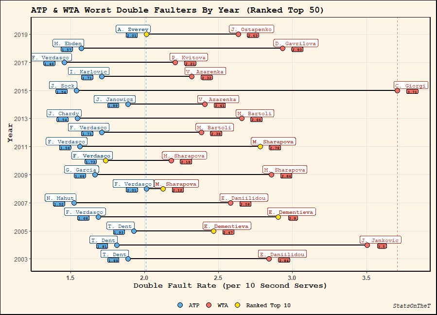
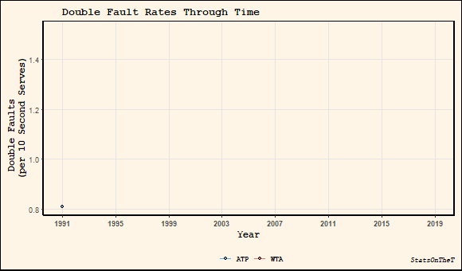
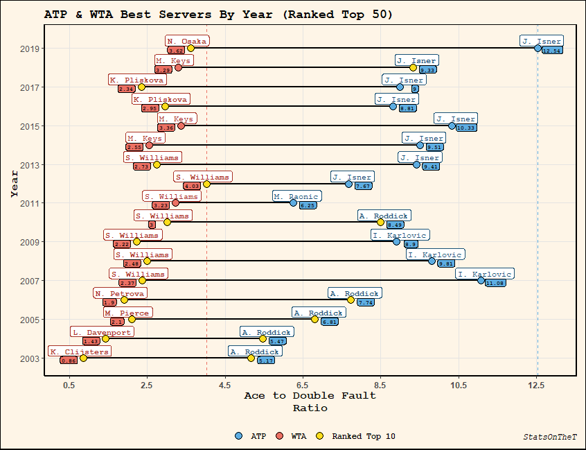
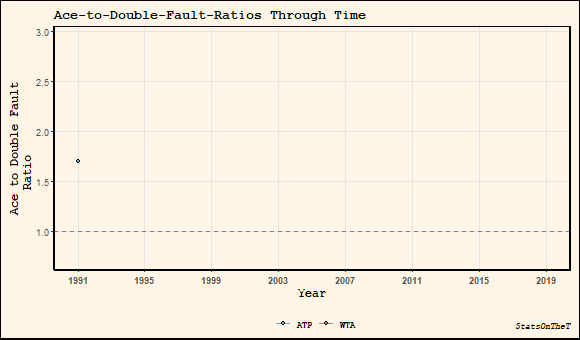
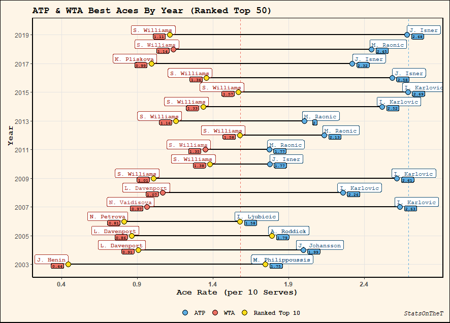
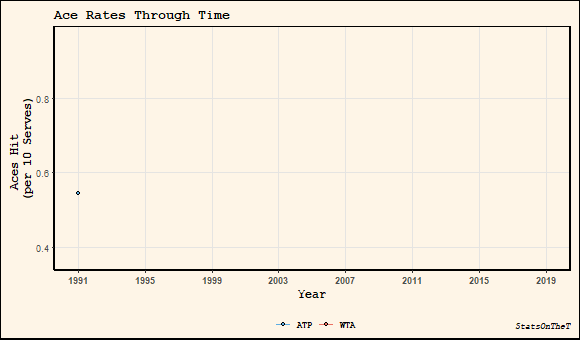

```{r setup, include=FALSE}

knitr::opts_chunk$set(echo = TRUE)

```

Sascha Zverev’s second serve is an anchor debilitating his game. Especially in 2019, Zverev struggled with his double fault control and lagged noticeably behind his peers on this grading scale. As a top 7 player, and arguably a legitimate contender on tour, has any other player with the same elite stature exhibited similar serve shortfalls?

In this post, we look at players who—for better or for worse—had some conspicuous serve performances in recent memory. We’ll also look at the evolution of serve rates in the past decade-and-a-half, and see who might be heralded as the serve stars of tomorrow.

For each year since 2003—a time when complete match data for both the [WTA](https://github.com/JeffSackmann/tennis_wta) and [ATP](https://github.com/JeffSackmann/tennis_atp) are available thanks to Jeff Sackmann—we calculated the average double fault rate for the top 50 year-end singles ranked players on tour, and plotted the most inclined double-faulters. To ease interpretation, the double fault rates are presented as the number of double faults per 10 **second** serve attempts. 

In blue, Zverev’s 2019 rate of over 2 double faults per 10 second serve attempts ranks him highest on our ATP board—tied with 2008 Fernando Verdasco. While Verdasco is a 6X double fault champion, he has mostly held ATP rankings outside the top 10 and does not hold the same notoriety as the perplexing Zverev. 



*Fig. 1: Lead Double Faulters for the top 50 year-end singles ranked players since 2003.*

Fans of early 00’s tennis may remember former top 3 player Guillermo Coria—a.k.a. [El Mago](https://www.youtube.com/watch?v=PMcjgcc8S_M)—who suffered from a severe case of the `yips`. Astonishingly, in 2006 `El Mago` averaged a deluge of **4 double faults per 10 second serves**—that’s over 40% of his second serve points donated to his opponent! Perhaps the most deserving of the all-time double fault throne, Coria unfortunately ranked 116th and did not qualify for our board. Officially retired in 2009, some say that Coria never recovered from his mental block and that his game really was [gone by 2006](https://www.essentialtennis.com/was-guillermo-coria-the-best-that-never-was/).

Switching over to the WTA side, we see that Sharapova is a four-peat double fault champion from 2008 to 2012. Her distinguished career—decorated with 5 grand slam trophies—was also entrenched in double fault tribulations. Burdened with shoulder pains that eventually [necessitated surgery by the end of 2008](https://www.theglobeandmail.com/sports/more-sports/double-faults-sink-sharapova/article1379288/), these injuries may have facilitated Sharapova’s dubious distinction of double fault titlist during this four year block. But even outside this peculiar time frame, Sharapova has shown a career attachment to donating her 2nd serve points. In fact of her entire 16 year campaign on the main tour, 11 of those years averaged a dismal rate surpassing 2 double faults per 10 attempts. 

Sharapova was not the only former WTA grand slam winner to have manifested a malignant reputation of double faulting. Azarenka has averaged a rate greater than 2 double faults 6X in her career, while Kvitova and Bartoli have reached this milestone 3X and 2X, respectively.  And lastly, perhaps the most extreme case of double faulting from a top 50 player comes from Giorgi who averaged a shocking 3.7 double fault rate in 2015.

Comparing the extreme cases from the WTA to the ATP, we see that the women on our leaderboard consistently surpassed the men in the rate of double faults hit.  Does this relationship exist if we instead consider a representative sample of both groups? Plotting the average double fault rate for the top 50 year-end ranked players, we can compare the WTA and ATP on a year-by-year basis. Since reliable ATP match data was recorded since 1991, we begin with the observed ATP rate preceding the WTA in time. 



*Fig. 2: Historic Double Fault rates for the top 50 year-end singles ranked players since 1991 (ATP) and 2003 (WTA).*

There is a huge drop-off in the double fault rate for the ATP compared to the WTA. Actually, this finding is consistent with some [recent criticisms](https://www.nytimes.com/2017/09/03/sports/tennis/us-open-wta-tour-serving.html) on the lamented WTA service game from members of the tennis inner circle. However, it does seem like the WTA is trending positively in reducing double faults—although it still has plenty room for improvement.

Double faults may provide some insight in how confident a player is in their serve, where more double faults usually signals a player's fragile state-of-mind. But in isolation, it does not always fully describe the serve performance. For instance, a player who chooses to deliberately hammer every serve—no matter the game situation at hand—will likely see an increase in double faults *and in aces too*. Ideally, this player would want a favourable `ace-to-double-fault-ratio`; that is, to minimize self-inflicted damage while simultaneously maximizing free points won.

With this in mind, we calculate the ace-to-double-fault-ratio as:

$\text{Ace-to-Double-Fault-Ratio} = \frac{\text{Total Aces Hit}}{\text{Total Double Faults Hit}}$


Let’s take a look at some historic performances from players who had tremendous control of their ace-to-double-fault-ratio.



*Fig. 3:  Lead ace-to-double-fault-ratio for the top 50 year-end singles ranked players since 2003.*

On our ATP leaderboard we see 3 big guns who have regularly terrorized opponents with their lethal serves. American cannon Andy Roddick appears 5X on our board—all while ranked within the top 10. Croatian 6’11 giant Ivo Karlovic is another staple on our board, showing up 3X. And finally, the winner for the past 8 years—including a *ridiculous* 12.54 aces-to-double-fault ratio record set in 2019—John Isner.

From the women’s side, there is no WTA player more synonymous with stringing aces—while also tapering double faults—than Serena Williams. She has consistently risen above the entire WTA field, and has flexed tremendous serve power and discipline in the past decade. These numbers back up the unassailable sentiment of Williams being the greatest WTA server of all time. 

Besides Williams, two potential successors who may one day bear the torch of excellence in women’s serving are Madison Keys and Naomi Osaka. In the past few years, this duo have surpassed Williams in the aces-to-double-fault ratio, and also have shown remarkable consistency on serve.

Looking again through time, we can see how the general serve ratios among top players are now, and have been in the past.



*Fig. 4: Historic ace-to-double-fault-ratio for the top 50 year-end singles ranked players since 1991 (ATP) and 2003 (WTA).*

The ATP is consistently replete with skilled servers who maintain a high ace-to-double-fault ratio.This may be a reflection of the serve being more of an engine that drives the men’s game, which allows them to easily set the tone for the rest of the rally. For them, more free points in aces are bagged while any double fault damage is safely attenuated. 

Meanwhile, the WTA has historically seen some struggles among many of their top players. Sadly, it is only recently where the WTA began averaging an ace-to-double-fault ratio greater than 1. Hitting below this threshold signals an *awful* return on their serve risk investment—essentially getting burned by more double faults than hitting aces. 

Rarely do we find WTA players packing a barrage of aces in their serve repertoire—which is a deterrent from achieving a high ace-to-double-fault ratio.That is not to say that a strong ratio is unimportant in the WTA. In fact, many WTA players leading in this serve ratio category are ranked within the top 10. The women’s serve has seen a continual and optimistic rise in quality. Let's hope it continues to develop into a more common and reliable weapon.


##


### Appendix

If you were curious about the leaders and the overall trend in aces—in isolation—we present them here. For aces, the rate is presented as the number of aces hit per 10 serve attempts since aces can be hit on either first or second serve—the former being the most common.



*Fig. 5:  Lead ace rates for the top 50 year-end singles ranked players since 2003.*



*Fig. 6: Historic double fault rates for the top 50 year-end singles ranked players since 1991 (ATP) and 2003 (WTA).*

Looking at the trajectory of ace rates among the top players, we see that there is in general an increase in aces hit. Such a gradual improvement  may partially be attributed to the increase in [player height](https://longislandtennismagazine.com/evaluating-trends-sport-tennis), as well as perhaps upgraded racket and string technology which have added more speed and power to the balls struck. Again, we do see a discrepancy between the ATP and WTA in serve rates


